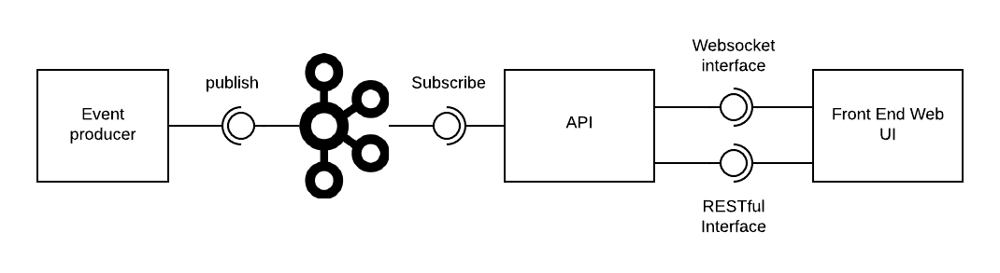

# Live Football Scores

This project acts as a demo on how you can use Apache Kafka and Websockets to create real-time event-based applications.

## Disclaimer

This project serves as a POC and is in no way intended to be used in production. These makes that there are a lot of possible improvements.
This is merely intended to show how components can be connected to create real-time front-ends based on a Kafka event broker.

## Architecture

The project consists of 4 major components:

* Data Producer
* Kafka broker
* Consumption API
* Front-end web UI

The image below shows the high level component overview of the architecture



### Data Producer

Producing the game events is mocked by a Python application, which posts events based on data files obtained from https://www.kaggle.com/hardikagarwal1/football-analytics-event-data-statsbomb . This data is in no way owned by me and is property of [StatsBomb](https://statsbomb.com/). Some examples of these data files are in the producers/data/events folder.

The producer uses a virtual clock to produce the events in a realistic way. The virtual clock has a configurable "speed up factor" to make it produce the events faster or slower.

The producer can be triggered to start producing the events of a game by making a POST call to the API at /games/{game_id}. The game id corresponds to the name of the JSON file, without the `.json` extension.

### Kafka broker

The kafka broker is obtained from the `wurstmeister/kafka` docker image, and combined with `wurstmeister/zookeeper`.

### Consumption API

The consumption API has a thread that consumes the Kafka events and parses game information. It also exposes an HTTP GET endpoint and a websocket endpoint to get information from games. The client can connect to the websocket and receive updates of the currently running games.
By design, only live games are shown here. 

The games are stored in memory. A possible improvement could be the use of an in-memory database to make sure the API is stateless.

### The front end

The front end consists of two components. The list of games that are currently active, and an Admin Panel that can be used to start games (POST call to the producer).

## How to use

The setup is wrapped in a docker-compose.yaml file. Use the below commands to interact with the stack

```
docker-compose rm -svf  # Clean between runs
docker-compose build --no-cache  # rebuild images
docker-compose up  # Run
```

## Demo

In the `docs` folder, a video of the working app (demo.mov) is included.
